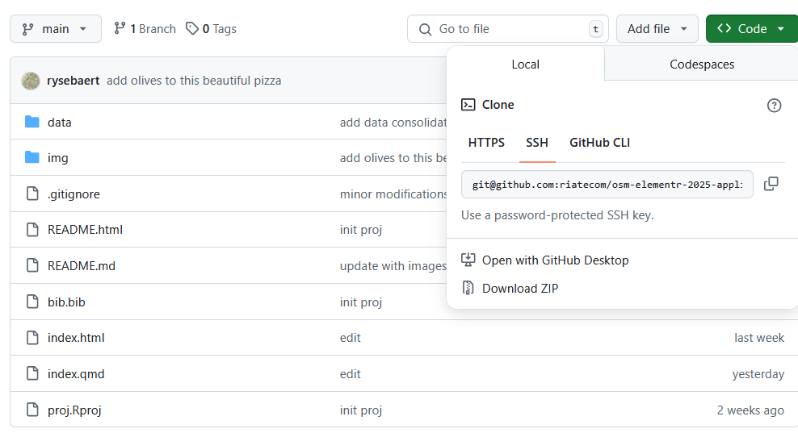

# Utiliser OpenStreetMap avec R - Mise en pratique

Réalisé par Louis Laurian, Ronan Ysebaert, Timothée Giraud et Matthieu Viry (UAR RIATE pour le groupe [ElementR](https://elementr.gitpages.huma-num.fr/website/apropos.html) en mai 2025.

## Contenu

Cette chaîne de traitements reproductible a pour vocation de mettre en pratique les éléments plus théoriques abordés [précédemment](https://github.com/riatecom/osm-elementr-2025). 
Elle peut utilement être remobilisée dans d’autres contextes spatiaux ou thématiques. 

Cette mise en pratique porte sur l'accessibilité aux bars et restaurants depuis la gare SNCF de Compiègne en utilisant exclusivement des données d'OpenStreetMap.


## Le notebook

Version en ligne accessible à l'adresse suivante : **[https://riatecom.github.io/osm-elementr-2025-application/](https://riatecom.github.io/osm-elementr-2025-application/)** 

<div align="center">
  <a href="Aménités gustatives à Compiègne">
    
  </a>
  <a href="La montagne alimentaire de Compiègne">
     
  </a>
  <a href="Isochrones autour de la gare de Compiègne">
     
  </a>
  <a href="Temps d'accès au restaurant le plus proche à Compiègne">
     
  </a>
  <a href="Nombre de restaurants à moins de 5 minutes à Compiègne">
     
  </a>
  <a href="La route des pizzas à Compiègne">
     
  </a>
</div>


## Rejouer l'analyse

Télécharger le contenu de ce dépôt, ouvrez le fichier proj.Rproj, puis le fichier script .R. Il reproduit en tout point le contenu du support de formation. 




## Extensibilité des analyses

Outre la reproductibilité des analyses proposées, nous montrons aussi leur **extensibilité** à d'autres contextes. 

Le script ne repose ainsi en entrée que sur une seule adresse (la gare de Compiègne dans le notebook). Nous l'avons transposé à 6 autres villes pour l'exemple. 
Les données issues du routage (temps de calcul un peu long pour utiliser le serveur de démonstration OSRM avec raison) ont été préparées en amont dans [ce dossier](https://github.com/riatecom/osm-elementr-2025-application/tree/main/data)

Elles permettent d'adapter le script sans recalculer les itinéraires aux contextes spatiaux suivants : Lille, Nantes, Clermont-Ferrand, Condorcet, Grenoble et Toulouse.  

<div align="center">
  <a href="Tournée des pizzerias à Lille">
    
  </a>
  <a href="Tournée des pizzerias à Condorcet">
     
  </a>
  <a href="Tournée des pizzerias à Toulouse">
     
  </a>
  <a href="Tournée des pizzerias à Grenoble">
     
  </a>
  <a href="Tournée des pizzerias à Nantes">
     
  </a>
  <a href="Tournée des pizzerias à Clermont-Ferrand">
     
  </a>
</div>

Voici le code R qui a permis de produire ces représentations graphiques

```
# Import packages
library(tidygeocoder) # géocodage
library(osmdata) # import de données OSM (vecteur)
library(maposm) # import de données OSM (couches géo)
library(osrm) # calcul d'itinéraires
library(sf) # manipulation de données vectorielles
library(mapsf) # cartographie thématique
library(maplegend) # légendes

# Import adresses
cs <- read.csv("data/case_studies.csv", encoding = "UTF-8", sep = ",")

for (i in 1:nrow(cs)){
  tmp <- cs[i,]
  adr <- tmp$adr
  lib <- tmp$lib
  
  # Géocodage ----
  pt <- data.frame(address = adr)
  pt <- geocode(.tbl = pt, address = "address", quiet = TRUE) |>
    st_as_sf(coords = c("long", "lat"), crs = 4326)
  
  # Emprise
  emprise <- st_buffer(pt, 3000) |>
    st_bbox()
  
  # Import de couches géographiques d'habillage avec maposm ----
  res <- om_get(x = c(st_coordinates(pt)[1],
                      st_coordinates(pt)[2]),
                r = 2000)
  
  # Import de points avec osmdata ----
  # Définir l'emprise et le type d'objets d'intérêt
  q <- opq(bbox = emprise, osm_types = "node")
  
  # Extraction des restaurants, bars et cafés
  req <- add_osm_feature(opq = q,
                         key = 'amenity',
                         value = c("bar", "cafe", "restaurant"))
  
  # Transformer en objet sf
  poi <- osmdata_sf(req)
  poi <- poi$osm_points
  
  # Sélectionner les variables
  poi <- poi[, c("osm_id", "name", "amenity", "cuisine")]

  # Intersection avec espace d'étude
  poi <- st_intersection(poi, st_transform(res$zone, crs = 4326))
  
  # Ne garder que les pizzas
  pizz <- poi[!is.na(poi$cuisine) & poi$cuisine == "pizza" , "geometry"]
  
  ## Calcul d'un trip ----
  # Ajouter le point de départ : la gare
  pizz <- rbind(pt[1, "geometry"], pizz)
  
  trip <- osrmTrip(loc = pizz,
                   overview = "full",
                   osrm.profile = "foot")
  
  trip <- trip[[1]]$trip
  trip <- st_transform(trip, crs = "EPSG:3857")
  
  # Pour les labels : récupérer le début de la ligne
  start <- lwgeom::st_startpoint(trip)
  start <- do.call(rbind, start)
  start <- data.frame(id = rownames(trip), X = start[,1], Y = start[,2])
  start <- st_as_sf(start, coords = c("X", "Y"), crs = "EPSG:3857")
  
  pizz <- poi[!is.na(poi$cuisine) & poi$cuisine == "pizza" ,]|>
    st_transform(crs = "EPSG:3857")
  
  mf_export(x = res$zone, filename = paste0("img/", lib, "_pizza.png"),
          width = 500)
  mf_map(res$urban, col = "#a83c0a", border = "#e0dfdf", lwd = .5)
  mf_map(res$green, col = "#569128", border = "#569128", lwd = .5, add = TRUE)
  mf_map(res$water, col = "#aad3df", border = "#aad3df", lwd = .5, add = TRUE)
  mf_map(res$railway, col = "grey80", lty = 2, lwd = .2, add = TRUE)
  mf_map(res$building, col = "#942222", border = "#942222", lwd = .5, add= TRUE)
  mf_map(res$road, col = "grey80", border = NA, lwd = .2, add = TRUE)
  mf_map(res$street, col = "grey80", border = NA, lwd = .2, add = TRUE)
  mf_map(res$zone, col = "#a83c0a33", alpha = .1, border = NA, add = TRUE)
  mf_map(res$zone, col = NA, border = "#d7b578", lwd = 15, add = TRUE) 
  mf_map(trip, col = "black", lwd = 3, lty = 3, add = TRUE)
  mf_map(start[start$id != 1, ], pch = 20, cex = 2, col = "black", add = TRUE)
  mf_map(pt_3857, pch = 24, cex = 1.3, col = "darkblue", lwd = 2, add = TRUE)
  mf_label(start, var = "id", cex = .8, overlap = FALSE, pos = 4, col = "black", halo = TRUE)
  mf_title(paste0(lib, " / La route de la pizza en ", 
                round(sum(trip$duration, 0)), " minutes à pieds"), pos = "center")
  mf_arrow()
  mf_scale(size = 500, scale_units = "m")
  mf_credits("OpenStreetMap contributors, 2025", pos = "bottomleft")
  dev.off()
}
```